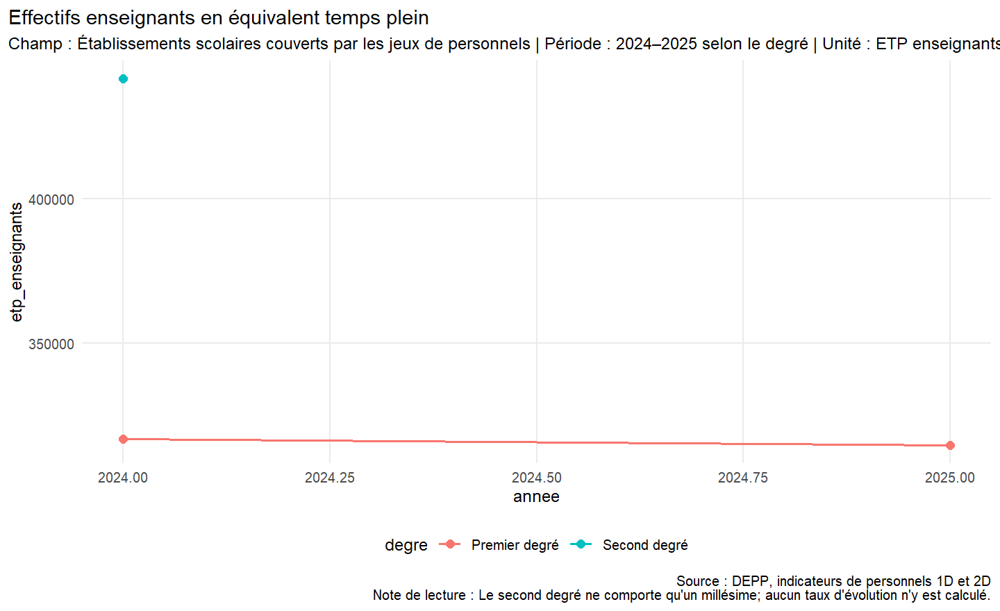
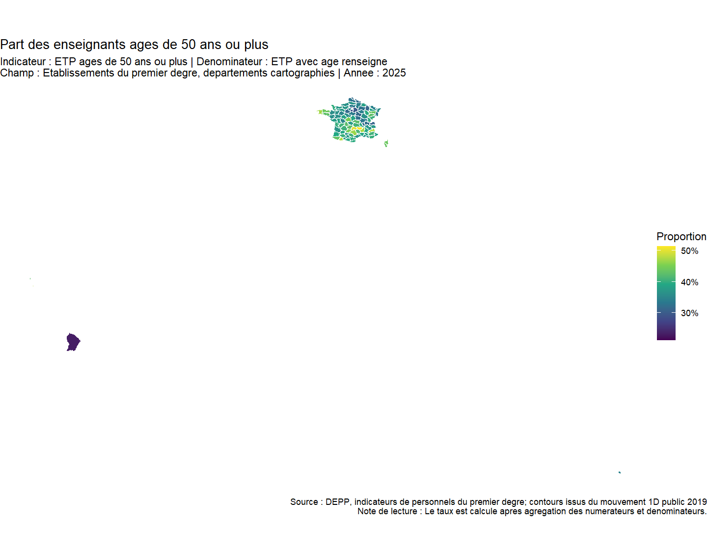
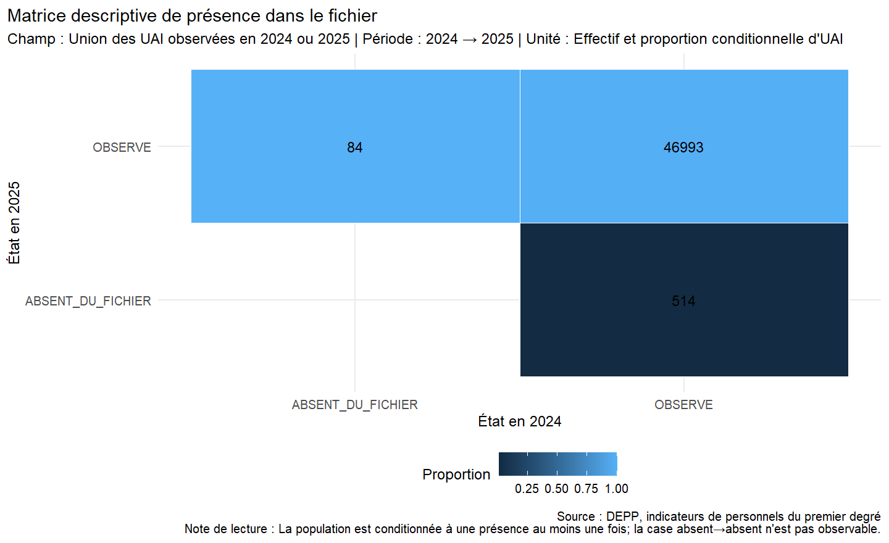

# Parcours et mobilité des personnels enseignants

> Démonstrateur reproductible de statistique publique fondé sur les données ouvertes de la DEPP et du ministère de l’Éducation nationale.

Ce projet étudie les effectifs, les profils et les disparités territoriales des personnels enseignants. Il montre aussi, de façon explicite et auditée, ce que les données ouvertes permettent — et ne permettent pas — d’établir sur les mobilités et les trajectoires professionnelles.

## Présentation

- [Site de présentation du projet](https://cmadjeki-dot.github.io/DEPP_A5_Mobilite_Personnels/)
- [Code source du tableau de bord Shiny](dashboard/app.R) — déploiement public en cours ; lancement local documenté ci-dessous.

Le dépôt couvre toute la chaîne d’une étude de statistique publique : recherche des sources, import traçable, contrôle qualité, préparation, construction d’indicateurs, analyses descriptive et territoriale, économétrie exploratoire, restitution, dashboard, tests et industrialisation.

L’unité disponible est principalement l’**établissement × année**, avec des effectifs exprimés en équivalents temps plein (ETP). Aucun identifiant individuel stable de personnel n’est publié.

## Contexte

La connaissance des parcours enseignants contribue au pilotage des ressources humaines, à l’analyse de l’attractivité des territoires et à la continuité du service public d’éducation. Les données ouvertes offrent plusieurs éclairages agrégés, mais le véritable suivi longitudinal des personnels relève de données administratives sécurisées non accessibles dans ce projet.

## Problématique

Quels profils et contextes territoriaux sont associés aux évolutions observées des personnels enseignants, et jusqu’où les données ouvertes permettent-elles d’étudier leurs mobilités et trajectoires professionnelles ?

## Questions de recherche

- Comment les effectifs enseignants évoluent-ils selon le degré et le millésime ?
- Comment se répartissent l’âge et l’ancienneté dans l’établissement ?
- Quelles disparités apparaissent entre départements, académies et régions ?
- Que décrivent les ratios départementaux du mouvement interdépartemental ?
- Quelles caractéristiques sont associées à l’absence d’une UAI du fichier suivant ?
- Un panel `personnel × année`, une analyse de survie et une prédiction à `t+1` sont-ils identifiables avec l’open data ?

## Données

Les sources sont officielles, documentées dans [`config/data_sources.yml`](config/data_sources.yml) et acquises sous Licence Ouverte 2.0.

| Source | Producteur | Millésime | Unité principale | Usage |
|---|---|---:|---|---|
| Indicateurs de personnels du premier degré | DEPP | 2024–2025 | établissement × année | effectifs, âge, ancienneté, territoire |
| Indicateurs de personnels du second degré | DEPP | 2024 | établissement × année | effectifs et profils |
| Mouvement interdépartemental du premier degré public | DGRH–DEPP | 2019 | département | ratios agrégés |
| Annuaire de l’éducation | Ministère | photographie 2026 | établissement | géographie et éducation prioritaire |
| Indices de position sociale | DEPP | 2022–2025 selon le degré | établissement × année | contexte social |

Les fichiers bruts sont immuables, horodatés et associés à leur provenance ainsi qu’à une empreinte SHA-256. Ils ne sont pas versionnés dans Git.

## Méthodologie

1. Audit de disponibilité et de granularité des sources.
2. Import reproductible avec conservation des fichiers bruts.
3. Diagnostic qualité avant nettoyage : clés, doublons, types, NA, bornes et cohérences.
4. Harmonisation documentée des noms, types, dates et nomenclatures.
5. Construction d’indicateurs lorsque numérateur, dénominateur et champ sont identifiables.
6. Analyses descriptive, territoriale et économétrique exploratoire.
7. Audits de faisabilité pour le longitudinal, la survie, le machine learning et l’explicabilité.
8. Restitution par Quarto, Shiny et tables préparées.

Le projet distingue systématiquement **observation**, **association statistique**, **prédiction** et **causalité**.

## Architecture

~~~text
DEPP_A5_Mobilite_Personnels/
├── config/              # sources et configuration
├── data/                # raw, données intermédiaires et traitées
├── R/                   # fonctions par domaine
├── notebooks/           # analyses Quarto
├── reports/             # rapport et note d’information
├── dashboard/           # application Shiny
├── outputs/             # tables, figures et preuves
├── tests/testthat/      # quatre familles de tests
├── docs/                # HTML rendus
├── _targets.R           # orchestration
└── renv.lock            # environnement verrouillé
~~~

## Pipeline

~~~mermaid
flowchart LR
  A[Sources] --> B[Import] --> C[Qualité] --> D[Nettoyage] --> E[Features] --> F[Panel]
  F --> G[Descriptif] --> I[Territoire]
  F --> H[Trajectoires]
  F --> J[Économétrie]
  F --> K[Survie]
  F --> L[ML] --> M[Évaluation]
  J --> N[Explicabilité]
  L --> N
  G --> O[Figures et tables]
  H --> O
  I --> O
  J --> O
  K --> O
  M --> O
  N --> O
  O --> P[Rapports et dashboard]
~~~

Le pipeline comporte 19 cibles `targets`. Une étape non identifiable produit un registre de faisabilité explicite, jamais un résultat simulé présenté comme observé.

## Résultats

Quelques résultats réellement obtenus :

- **314 691,5 ETP** enseignants du premier degré en 2025, contre 316 886,5 en 2024, soit **−0,7 %** ;
- parmi les ETP du premier degré dont l’âge est renseigné en 2025, **35,2 % ont 50 ans ou plus** ;
- parmi les ETP renseignés sur l’ancienneté dans l’établissement, **27,0 % ont moins de deux ans d’ancienneté** et 38,7 % huit ans ou plus ;
- **98,7 %** des UAI observées au moins une fois en 2024 ou 2025 figurent dans les deux fichiers ; cette présence n’est pas une trajectoire individuelle ;
- le modèle logistique exploratoire porte sur l’absence d’une UAI dans le fichier 2025, et non sur la mobilité d’un enseignant. Il décrit des associations conditionnelles sans identification causale.

## Visualisations

### Évolution des effectifs

### Composition territoriale

### Présence des établissements entre millésimes

Chaque graphique précise le champ, la période, l’unité, la source et, si nécessaire, une note de lecture.

## Dashboard

L’application [`dashboard/app.R`](dashboard/app.R) comporte sept onglets : Vue générale, Profils, Mobilités, Territoires, Trajectoires, Modélisation et Méthodologie. Elle consomme les résultats préparés sans recalculer toutes les analyses au lancement.

**Accès :** le [code du tableau de bord](dashboard/app.R) est disponible dans le dépôt. Son URL publique sera ajoutée ici dès la finalisation du déploiement Shiny. En attendant, il peut être exécuté localement avec la commande suivante :

~~~r
shiny::runApp("dashboard")
~~~

Le déploiement public sur shinyapps.io est automatisé par [`dashboard/deploy.R`](dashboard/deploy.R). Après avoir enregistré les trois variables `SHINYAPPS_ACCOUNT`, `SHINYAPPS_TOKEN` et `SHINYAPPS_SECRET` dans le fichier local `.Renviron`, exécuter :

~~~r
source("dashboard/deploy.R")
~~~

Le script publie uniquement l’application et ses résultats préparés. Les données brutes et les identifiants ne sont pas envoyés.

## Rapports

- [Note d’information synthétique](docs/reports/note_information.html)
- [Rapport méthodologique complet](docs/reports/rapport_methodologique.html)
- [Fiche scientifique](notebooks/00_fiche_scientifique.qmd)
- [Audit des données](notebooks/01_audit_donnees.qmd)

## Reproductibilité

Le projet mobilise `renv` pour verrouiller 175 packages, `targets` pour l’exécution incrémentale, `testthat` pour quatre familles de contrôles, Quarto pour les documents auditables et Git pour la traçabilité.

Une restauration complète dans une bibliothèque temporaire neuve a validé les 175 packages : 166 restaurés par `renv`, 9 fournis par R et aucun manquant. Les preuves sont dans [`outputs/reproducibility/`](outputs/reproducibility/).

## Installation

Prérequis : R 4.6.1, Quarto 1.10.18 et Git.

~~~powershell
git clone https://github.com/cmadjeki-dot/DEPP_A5_Mobilite_Personnels.git
cd DEPP_A5_Mobilite_Personnels
~~~

Puis dans R :

~~~r
install.packages("renv")
renv::restore()
~~~

## Exécution

~~~r
targets::tar_make()                    # exécuter les cibles périmées
targets::tar_visnetwork()              # superviser le graphe
targets::tar_read(descriptive_results) # lire un résultat
testthat::test_dir("tests/testthat")    # exécuter les tests
~~~

Rendu indépendant d’un rapport :

~~~powershell
quarto render reports/rapport_methodologique.qmd
~~~

## Limites

- aucun identifiant individuel stable de personnel ;
- seulement deux millésimes dans le premier degré et un dans le second ;
- données de personnels agrégées en ETP au niveau établissement ;
- secret statistique sur certaines composantes ;
- ratios départementaux du mouvement limités à 2019 ;
- absence de flux individuels origine–destination et de motifs de sortie ;
- éducation prioritaire issue d’une photographie 2026 ;
- risque d’erreur écologique ;
- aucune stratégie d’identification causale.

Le projet ne prétend donc pas mesurer des trajectoires individuelles, estimer une durée avant mobilité ni prédire la mobilité à `t+1` avec les données disponibles.

## Compétences mobilisées

- statistique publique et documentation des champs ;
- recherche, audit et traçabilité de données ouvertes ;
- data engineering reproductible en R ;
- contrôle qualité et tests automatisés ;
- analyse descriptive et visualisation avec `ggplot2` et `gt` ;
- analyse territoriale avec `sf` ;
- économétrie exploratoire et diagnostics ;
- conception longitudinale et audit de faisabilité ;
- prévention des fuites en machine learning ;
- industrialisation avec `targets`, `renv`, Quarto et Git ;
- restitution par rapport et dashboard Shiny.

---

Projet démonstrateur : les interprétations reposent uniquement sur les données ouvertes acquises et les résultats reproductibles du dépôt.

## Auteur

**Cédric MADJEKI-MA-MOUSSAVOU BIGNOUMBA**

Compte GitHub : [cmadjeki-dot](https://github.com/cmadjeki-dot). Projet personnel de démonstration méthodologique, sans affiliation institutionnelle revendiquée.
